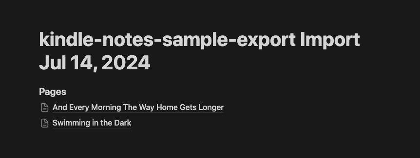
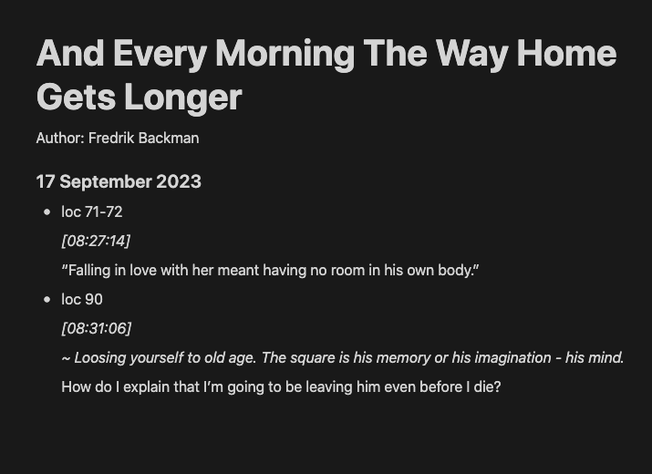

# Sample Import
`kindle-notes-sample-export.zip` is a sample you can import into Notion to see whether the formatting is something you want. 

## Sample Images
After importing, the main page will look like this:

And the highlights will be of the following format:
